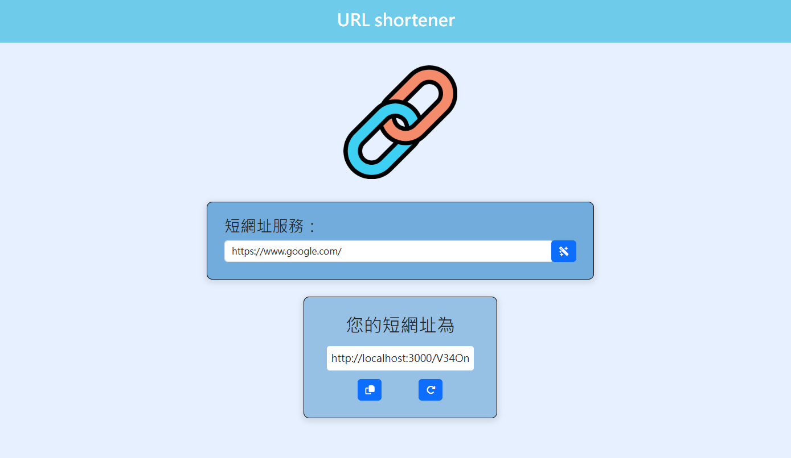

# URL shortener



## 介紹

可供使用縮短網址服務

### 功能

* 將較長的網址縮短成較短的網址


## 開始使用

1. 請先確認已安裝 node.js 與 npm

2. 接著將此專案 clone 至欲安裝之位置

   ```bash
   $ git clone https://github.com/w3i3538/URLshortener
   ```

3. 在本地開啟之後，開啟終端機，並確認處於本專案資料夾中


4. 透過npm安裝4.18.2版本express輸入：

   ```bash
   $ npm i express@4.18.2
   ```

5. 透過npm安裝7.0.7版本express-handlebars輸入：

   ```bash
   $ npm i express-handlebars@7.0.7
   ```

6. 過npm安裝16.3.1版本的Dotenv和7.3.0版本的mongoose輸入:

   ```bash
   $ npm i mongoose@7.3.0
   $ npm i dotenv -D
   ```

7. 安裝完畢後，繼續輸入，開啟伺服器：

   ```bash
   npm run dev
   ```

8. 若看見此行訊息則代表伺服器順利運行，打開瀏覽器進入到以下網址

   ```bash
   App is running on http://localhost:3000
   ```

9. 若欲暫停使用

   ```bash
   ctrl + c
   ```

## 開發工具

- Node.js 18.16.0
- Express 4.18.2
- Express-Handlebars 7.0.7
- Bootstrap 5.3.0
- Font-awesome 5.8.1
- Dotenv 16.3.1
- Body-parser 1.20.2
- MongoDB
- mongoose 7.3.0